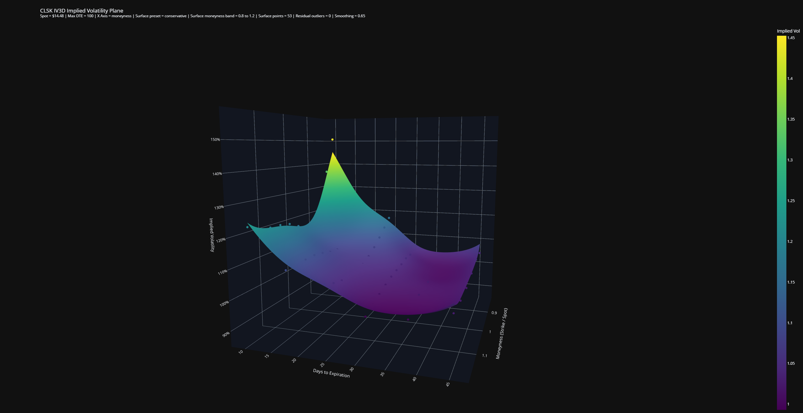
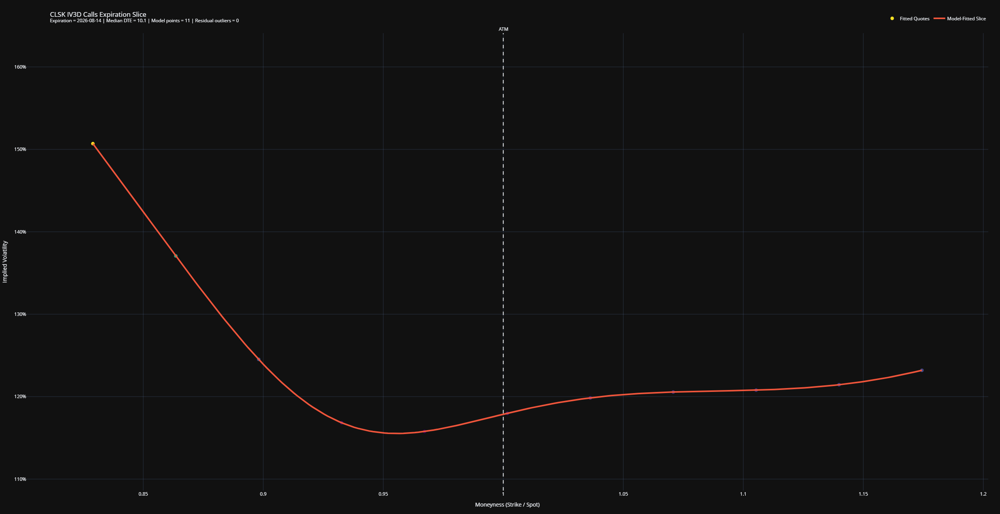

# Implied Volatility Surface & Options Analytics Engine

A Python options-analytics application that retrieves live option-chain data, calibrates mixture-of-Black-Scholes models by expiration, and generates interactive implied-volatility surfaces and expiration slices.

## Overview

The engine is designed as an exploratory derivatives-analysis tool. It converts live market quotes into a cleaned option dataset, fits each expiration independently, derives model-fitted implied volatilities, and presents the results through interactive Plotly visualizations and strike-level comparison tables.

The repository uses a small public launch file, `iv_surface.py`, while the complete implementation lives in `iv_engine.py`. This keeps the file you run easy to identify without hiding the underlying modeling code.

## Sample Outputs

### 3D Implied Volatility Surface



### Expiration Slice



## Features

- Retrieves live option chains and spot prices through `yfinance`
- Loads short-term Treasury rates from official U.S. Treasury tables, with a market-data fallback
- Supports call and put analysis across configurable expiration horizons
- Solves implied volatility from market and model-fitted option prices
- Calibrates one- to three-component mixture-of-Black-Scholes models by expiration
- Uses multi-start constrained optimization, bid-ask-aware weighting, robust loss, and regularization
- Identifies residual pricing outliers before constructing the primary surface
- Builds an interactive 3D implied-volatility surface by moneyness or strike and days to expiration
- Produces a 2D expiration slice with at-the-money reference markers
- Compares selected strikes using Greeks, liquidity measures, pricing diagnostics, and projected no-move time decay
- Optionally exports diagnostic CSV files and responsive HTML visualizations
- Includes deterministic regression tests and an automated GitHub Actions workflow

## Methodology

For each expiration, the application fits a weighted mixture of Black-Scholes component prices. The calibrated parameters include component weights, forward levels, and volatilities. Fitted prices are then inverted through a Black-Scholes implied-volatility solver to create the surface points.

The calibration process uses:

- Multiple initial parameter sets
- `L-BFGS-B` and `Powell` optimization
- Pseudo-Huber residual loss
- Quote-quality and bid-ask-based weighting
- Regularization of component dispersion
- Absolute and relative residual-outlier thresholds

A radial basis function interpolator is used to create a smooth visualization across moneyness and time to expiration.

## Requirements

- Python 3.10 or newer
- Internet access for live market and Treasury data

Install dependencies with:

```bash
python -m pip install -r requirements.txt
```

## Usage

Run interactively from the repository folder:

```bash
python iv_surface.py
```

`iv_surface.py` is the entry point. Keep it in the same folder as `iv_engine.py`.

The program prompts for:

- Ticker symbol
- Maximum days to expiration
- Target expiration slice
- Calls or puts
- Moneyness display preset

Command-line arguments are also supported:

```bash
python iv_surface.py CLSK 120 auto calls focused
```

## Outputs

The program can generate:

- Interactive 3D implied-volatility surface in HTML
- Interactive 2D expiration slice in HTML
- Strike comparison tables in the terminal
- Optional CSV files containing cleaned contracts, fitted surface points, and residual outliers

## Tests

Run the deterministic regression suite with:

```bash
python -m unittest test_iv_engine.py
```

The tests verify option-side parsing, Black-Scholes call-put parity, implied-volatility inversion, moneyness-preset resolution, and monotonic mixture call prices. GitHub Actions runs this suite automatically after repository updates.

## Project Structure

```text
implied-volatility-surface/
├── iv_surface.py             # file to run
├── iv_engine.py              # data, pricing, calibration, reporting, and plots
├── test_iv_engine.py         # deterministic regression tests
├── requirements.txt
├── README.md
├── .gitignore
├── .github/
│   └── workflows/
│       └── tests.yml
└── images/
    ├── iv_surface_3d.png
    └── expiration_slice.png
```

## Limitations

- Market data quality depends on the availability and accuracy of third-party option quotes.
- Wide spreads, stale quotes, and illiquid contracts can materially affect fitted results.
- The model fits expirations independently and does not guarantee a fully arbitrage-free volatility surface across both strike and maturity.
- The interpolated surface is intended for analysis and visualization rather than production pricing or execution.
- Live-data behavior can change when upstream Treasury or Yahoo Finance formats change; the automated suite intentionally tests deterministic model components without requiring network access.

## Disclaimer

This project is for educational and research purposes only. It is not investment advice and should not be used as the sole basis for trading, valuation, or risk-management decisions.
